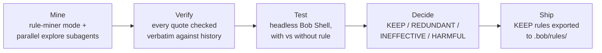

# RuleProof

**Turn a repository's lived history into verified AI-agent rules — mine, test, keep only what works.**

🔗 **[Live demo → ruleproof.vercel.app](https://ruleproof.vercel.app)**

---

## The Problem

- **Agents repeat team mistakes.** Without project-specific context, an AI coding agent has no memory of patterns the team has already rejected in review.
- **Hand-written rules and `/init`-generated files are guesswork.** No one knows which rules actually change agent behaviour until someone measures it.
- **Research confirms the cost.** ETH Zurich's AGENTbench study ([arXiv 2602.11988](https://arxiv.org/abs/2602.11988)) found that LLM-generated context files **did not improve task success** (slightly lower on average) while **adding over 20 % to cost**.

---

## How It Works



| Step | What happens | Tooling |
|------|-------------|-----------------|
| **Mine** | Parallel subagents read review comments, git log (incl. reverts) and CI logs and propose rules for mistakes raised in ≥2 places, each with exact quotes | Bob IDE custom mode `rule-miner`, parallel `explore` subagents |
| **Verify** | Every quote must appear verbatim in the history (typographic quotes/whitespace normalized); unverifiable rules are rejected before testing | `scripts/verify-evidence.mjs` (deterministic, no AI) |
| **Test** | For each rule, Bob performs the same coding task on throwaway copies of the repo, with and without the rule in `.bob/rules/`, 3 repeats each; a behavioral check scores the result | Headless Bob Shell (`bob run --mode agent`) via `runner.mjs`; checks in `checks/` |
| **Decide** | KEEP only if the rule measurably raises the pass rate; REDUNDANT if Bob already passes without it | `runner.mjs` → `results/results.json` |
| **Ship** | Only KEEP rules are exported (dashboard "Download rules") for the project's `.bob/rules/` | Bob rule layers |

---

## Results

All numbers come from `results/results.json` and `results/suite.json` — nothing is invented.

**Bob Shell version:** 2.0.4 · **Repeats per condition:** 3 · **Per-rule A/B cost:** 1.88 Bobcoins (30 runs) · **Head-to-head cost:** 3.47 Bobcoins (45 runs)

### Per-rule verdict

| Rule | Rule text (abbreviated) | Verdict | Pass without rule | Pass with rule |
|------|------------------------|---------|:-----------------:|:--------------:|
| R1 | Check `order.status === 'shipped'` before cancel/modify | **KEEP** | 0 % | 100 % |
| R2 | Call `audit.record()`, never `audit.log()` | **KEEP** | 0 % | 100 % |
| R3 | Use `clock.now()` for all timestamps | REDUNDANT | 100 % | 100 % |
| R4 | Issue refunds via `payments.refund()` | REDUNDANT | 67 % | 100 % |
| R5 | Use `Math.floor` for partial refund cents | **KEEP** | 0 % | 100 % |

> R3 is REDUNDANT: Bob already uses `clock.now()` because the existing code shows the pattern.
> R4 is borderline (67 % without the rule). Its only failure was an `audit.log()` crash — R2's mistake, not R4's. In the head-to-head below, RuleProof's rule set (which drops R4) still passed R4's task 3/3.

### Head-to-head: no rules vs Bob `/init` vs RuleProof

| Condition | Pass rate | Avg Bobcoins / run | Rules size |
|-----------|:---------:|:------------------:|:----------:|
| No rules | 20 % | 0.061 | 0 chars |
| Bob `/init` | 33 % | 0.100 | 3 510 chars |
| **RuleProof** | **100 %** | **0.070** | **481 chars** |

Five tasks × three repeats per condition. RuleProof reaches a **100 %** pass rate with a rule file **7× smaller** than Bob's `/init` output (481 vs 3 510 chars) and **~30 % lower cost per run** than `/init` (0.070 vs 0.100 Bobcoins). `/init` captured only the `clock.now()` convention — the one rule A/B testing had already marked REDUNDANT.

---

## Real Repository: `sindresorhus/ky`

RuleProof was also run against the public [ky](https://github.com/sindresorhus/ky) HTTP library to demonstrate mining on a real open-source project.

**Mining results (`out/real-ky/candidates.json`):** 10 candidate rules from **256 anonymized review comments (60 PRs)**. Each rule was raised in 2–6 different PRs (25 PRs in total) and is backed by 2–7 quotes; **all 36 quotes verified verbatim** (`out/real-ky/verification.json`).

Two examples:

> **R1 — Docs sync:** *"Keep TypeScript JSDoc comments and the README in sync: every option, parameter, or behaviour documented in one must be mirrored in the other."*
> 7 review comments across 6 PRs (#417, #454, #459, #611, #632, #840).

> **R2 — AVA `t.plan()`:** *"Use `t.plan()` in every AVA test that contains async callbacks or hooks so that missing or skipped assertions are caught as test failures."*
> 3 review comments across 2 PRs (#671, #772).

The real-repo rules have not been A/B-tested (see [Limitations](#limitations)), but the mining pipeline ran end-to-end and evidence is traceable to real GitHub review comments.

---

## Quickstart

**Prerequisites:** Node.js 24 (tested), Bob Shell 2.0.4 (`bob`), and for real runs a Bob API key with **Inference** scope.

```bash
# 1. Verify that every mined quote exists verbatim in the history
node scripts/verify-evidence.mjs out/real-ky/candidates.json samples/real-ky.history
node scripts/verify-evidence.mjs out/candidates.json samples/harbor-orders.history samples/harbor-orders/src

# 2. Dry-run the A/B pipeline without calling Bob (free)
node runner.mjs --rules R1 --repeats 1 --fake

# 3. Real runs (Windows): the wrapper decrypts the key from DPAPI storage into the child process only
powershell -File scripts/with-bob-key.ps1 node runner.mjs --rules R1,R2,R3,R4,R5 --repeats 3
powershell -File scripts/with-bob-key.ps1 node runner.mjs --suite --repeats 3
#    (on other systems: set BOB_API_KEY in your environment and run node runner.mjs … directly)

# 4. Publish results to the dashboard and view it locally
node scripts/publish-results.mjs
node scripts/serve.mjs dashboard   # http://localhost:5173
```

> The key is created once with `Read-Host -AsSecureString | Export-Clixml …` and lives outside the repo; `runner.mjs` only reads `BOB_API_KEY` from its environment and never prints or writes it.

---

## Repository Layout

```
ruleproof/
├── runner.mjs              # Headless Bob Shell harness (A/B test runner)
├── results/
│   ├── results.json        # Per-rule A/B results (verdicts, pass rates, costs)
│   └── suite.json          # Head-to-head aggregate (none / init / ruleproof)
├── out/
│   └── real-ky/
│       └── candidates.json # Rules mined from sindresorhus/ky
├── samples/
│   ├── harbor-orders/          # Synthetic order service under test (no rules inside)
│   ├── harbor-orders.history/  # Its synthetic review comments, git log, CI log
│   └── real-ky.history/        # 256 anonymized real review comments (sindresorhus/ky)
├── tasks/                  # Task prompts given to the agent under test
├── checks/                 # Assertion harnesses for each task
├── baseline-init/          # Bob /init-generated rules (the comparison baseline)
├── scripts/
│   ├── verify-evidence.mjs # Evidence quality checker
│   ├── serve.mjs           # Local dashboard server
│   ├── publish-results.mjs # Copies results into dashboard/data/ (Vercel serves dashboard/)
│   ├── fetch-reviews.mjs   # Fetches + anonymizes public PR review comments
│   └── with-bob-key.ps1    # DPAPI key loader (Windows)
├── dashboard/              # Web dashboard source
├── bob_sessions/           # Bob IDE task-summary screenshots (tasks 01–13)
│   └── shell/              # Bob Shell session logs
└── DATA_SOURCES.md         # Full provenance for all data
```

---

## Bob Usage

All code in this repository was written with Bob IDE, and every A/B run was executed by Bob Shell on the hackathon account. Each Bob change was reviewed before commit; a handful of factual corrections in this README (numbers, command syntax) were made by hand after cross-checking against the result files.

| Session | What was built / run | Mode |
|---------|---------------------|------|
| `bob_sessions/constantin_task01` | Project scaffold | Bob IDE (Agent) |
| `bob_sessions/constantin_task02` | Synthetic order-service sample | Bob IDE (Agent) |
| `bob_sessions/constantin_task03` | `rule-miner` custom mode | Bob IDE (Agent) |
| `bob_sessions/constantin_task04` | Mining the synthetic history | Bob IDE (rule-miner) |
| `bob_sessions/constantin_task05` | Tasks and assertion checks | Bob IDE (Agent) |
| `bob_sessions/constantin_task06` | `runner.mjs` harness | Bob IDE (Agent) |
| `bob_sessions/constantin_task07` | Dashboard + `serve.mjs` | Bob IDE (Agent) |
| `bob_sessions/constantin_task08` | `/init` baseline rules | Bob IDE (Agent) |
| `bob_sessions/constantin_task09` | Suite mode (3-condition A/B) | Bob IDE (Agent) |
| `bob_sessions/constantin_task10` | Fetching real ky reviews | Bob IDE (Agent) |
| `bob_sessions/constantin_task11` | Mining `sindresorhus/ky` | Bob IDE (rule-miner) |
| `bob_sessions/constantin_task12` | Evidence verifier + dashboard update | Bob IDE (Agent) |
| `bob_sessions/constantin_task13` | This README | Bob IDE (Agent) |
| [`bob_sessions/shell/shell01`](bob_sessions/shell/shell01_sample_history.json) | Synthetic review / git / CI history for the sample | **Bob Shell** (headless) |
| [`results/*.log.txt`](results/) | 75 A/B runs (30 per-rule + 45 head-to-head), each with its Bob task id in `results/*.json` | **Bob Shell** (headless, via `runner.mjs`) |

Bob Shell (`runner.mjs`) drives the agent headlessly: it spawns one Bob task per `(rule, condition, repeat)` triple, injects the rule context, runs the task prompt, then evaluates assertions — all without a human in the loop.

---

## Limitations

- **Synthetic A/B sample.** The A/B results come from `samples/harbor-orders.history`, a purpose-built synthetic repository. Real-world numbers may differ.
- **3 repeats per condition.** Statistical noise is non-trivial at n = 3. Borderline rules (e.g. R4 at 67 % baseline) could change verdict with more runs.
- **Real repo not A/B-tested.** The `ky` rules were mined and their evidence verified, but no automated A/B pass was run against the real repository.
- **One Bob version, one day.** All runs used Bob Shell 2.0.4 on 25 Sep 2026. Bob routes requests to its own models, which cannot be pinned, so results may shift with future Bob releases — rerun `runner.mjs` to re-measure.

---

## Data Sources

See [`DATA_SOURCES.md`](DATA_SOURCES.md) for full provenance of all inputs (synthetic history, real GitHub reviews, external research references).

---

## License

MIT — see [`LICENSE`](LICENSE).
